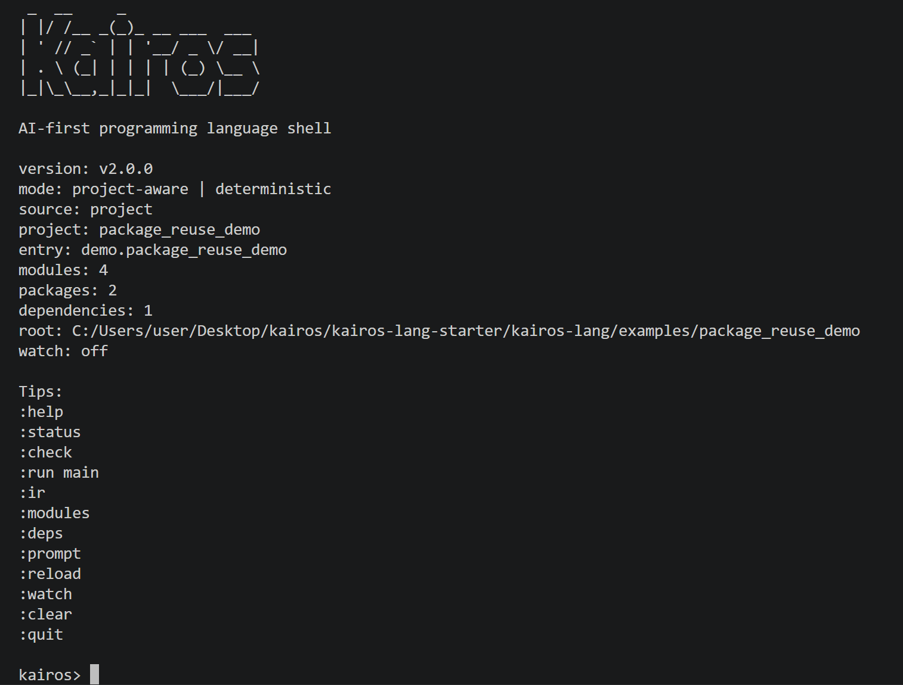

# Kairos

Kairos is an AI-first programming language and terminal-native language platform for deterministic `.kai` projects.

Tagline: *Code the right answer at the right moment.*

Kairos is built for code that must be readable by humans, reliable for automation, and directly useful to downstream LLM systems. The language favors explicit meaning, explicit contracts, stable machine-readable outputs, and practical terminal workflows over implicit behavior.

## Kairos 2.0

Kairos v2.0 turns the original local toolchain into a stronger language platform:

- Rust workspace with clean `build`, `test`, `fmt`, and `clippy` flows
- lexer, parser, AST, semantics, KIR, formatter, interpreter, and CLI
- project-aware workflows through `kairos.toml`
- deterministic multi-file module loading and validation
- `pub` visibility, selective imports, and import aliases
- local path-based package reuse through `[dependencies]`
- stable AST JSON, KIR JSON, prompt markdown, diagnostics JSON, and execution JSON
- first-class `kairos test` and `kairos doctor`
- interactive shell with reload, watch, and dependency introspection
- scaffolding through `kairos new` and `kairos init`

## Why Kairos exists

Kairos treats source code as something that should be understandable by:

- humans
- compilers
- LLMs
- retrieval systems
- prompt and policy pipelines

Instead of hiding intent in comments or repository folklore, Kairos makes meaning explicit through:

- `context`
- `describe`
- `tags`
- `requires`
- `ensures`
- explicit modules, packages, and deterministic imports

## Install

### Build locally

```powershell
cargo build --workspace
cargo test --workspace
```

### Install locally

```powershell
cargo install --path crates/kairos-cli
```

After that, run `kairos` directly from PowerShell, Windows Terminal, or the VS Code terminal.

## Quick start

The fastest way to explore Kairos is to use a bundled project:

```powershell
cargo run --bin kairos -- check examples\assistant_briefing
cargo run --bin kairos -- prompt examples\assistant_briefing
cargo run --bin kairos -- shell examples\assistant_briefing
```

If you want to see local package reuse and tests:

```powershell
cargo run --bin kairos -- check examples\package_reuse_demo --json
cargo run --bin kairos -- test examples\package_reuse_demo
cargo run --bin kairos -- doctor examples\package_reuse_demo
```

If you want the smallest first example:

```powershell
cargo run --bin kairos -- check examples\hello_context
cargo run --bin kairos -- run examples\hello_context --json
```

## Shell

Kairos includes a line-oriented interactive shell:

```powershell
cargo run --bin kairos -- shell examples\assistant_briefing
```

The shell shows a Kairos startup banner, current mode, package/module metadata, and quick-start commands before presenting the prompt.

<p align="center">
  
</p>

Useful shell commands:

- `:help`
- `:status`
- `:modules`
- `:deps`
- `:check`
- `:prompt`
- `:run main`
- `:reload`
- `:watch`
- `:unwatch`
- `:quit`

The shell is not a fake demo mode. It calls the real project loader, parser, semantic analyzer, KIR lowering, prompt renderer, and deterministic interpreter.

## Create a project

```powershell
cargo run --bin kairos -- new demo_project
cargo run --bin kairos -- new rules_demo --template rules

Set-Location .\demo_project
cargo run --bin kairos -- check .
cargo run --bin kairos -- test .
cargo run --bin kairos -- doctor .
cargo run --bin kairos -- shell .
```

Or initialize the current directory:

```powershell
cargo run --bin kairos -- init
cargo run --bin kairos -- init --template briefing
```

Available templates:

- `default`
- `briefing`
- `rules`

Generated projects validate immediately and now include a starter Kairos-native test.

## Core CLI

Kairos 2.0 keeps the command surface focused:

- `kairos check <file-or-project> [--json]`
- `kairos fmt <file-or-project> [--check] [--stdout]`
- `kairos ast <file-or-project> [--json]`
- `kairos ir <file-or-project> [--json]`
- `kairos prompt <file-or-project>`
- `kairos run <file-or-project> [--function <name>] [--arg <value> ...] [--json]`
- `kairos test <file-or-project> [--filter <text>] [--json]`
- `kairos doctor [path] [--json]`
- `kairos shell [path]`
- `kairos new <name> [--template <template>]`
- `kairos init [--template <template>]`

Machine-readable commands stay quiet and stable in JSON mode. Human-readable flows such as `shell`, `check`, `doctor`, `test`, and default `run` output are optimized for terminal use.

## Project model

Kairos projects are rooted by `kairos.toml`:

```toml
[package]
name = "package_reuse_demo"
version = "2.0.0"
entry = "src/main.kai"

[dependencies]
shared_rules = { path = "../shared_rules_lib" }

[build]
emit = ["ast", "ir", "prompt"]
```

Current rules:

- `package.entry` must point to a relative `.kai` file inside the project
- the parent directory of `package.entry` is treated as the package source root
- every `.kai` file under that source root is loaded deterministically
- local dependencies are path-based only and stay fully local
- modules are resolved by explicit `module` declarations and imported with explicit `use`
- unresolved imports, duplicate modules, dependency cycles, and invalid package boundaries are hard errors

## Example import forms

```kai
module demo.package_reuse_demo;
use shared.rules_lib.api as rules_api;
use shared.rules_lib.text::{headline as library_headline};

fn main() -> Str
describe "Reuse a local package through explicit imports"
tags ["dependency", "demo"]
requires []
ensures [len(result) > 0]
{
  return concat(library_headline("kairos platform"), concat(" => ", rules_api::classify(72)));
}
```

## Deterministic outputs

Kairos emits stable artifacts for downstream tooling:

- AST JSON for syntax structure
- KIR JSON for normalized machine-facing structure
- prompt markdown for system/context generation
- structured diagnostics with severity, code, message, location, and related notes
- deterministic execution reports
- deterministic test reports
- deterministic doctor reports

## Bundled examples

- `examples/hello_context`: smallest single-module smoke test
- `examples/video_context`: context + type declarations + prompt export
- `examples/risk_rules`: deterministic rule execution in one file
- `examples/assistant_briefing`: multi-file AI-context project
- `examples/decision_bundle`: multi-file decision/rules project with Kairos-native tests
- `examples/stdlib_playbook`: multi-file stdlib showcase
- `examples/shared_rules_lib`: reusable local package with explicit public APIs
- `examples/package_reuse_demo`: local dependency reuse with alias and selective import forms

## Validation

```powershell
cargo build --workspace
cargo test --workspace
cargo fmt --all
cargo fmt --all -- --check
cargo clippy --workspace --all-targets --all-features -- -D warnings
```

These commands pass in the current repository state.

## Intentional limits in 2.0

Kairos 2.0 is still deliberately focused:

- no remote package registry or networked dependency installation
- no user-program networking, file I/O, randomness, wall-clock time, or async runtime
- no full-screen TUI or editor/LSP layer
- no general-purpose OS scripting ambition
- no advanced macro system or non-deterministic runtime features by default

This narrow scope is deliberate. Kairos is strongest when it stays explicit, deterministic, and scriptable for both humans and AI systems.

## Documentation

- [ARCHITECTURE.md](ARCHITECTURE.md)
- [ROADMAP.md](ROADMAP.md)
- [CONTRIBUTING.md](CONTRIBUTING.md)
- [docs/cli.md](docs/cli.md)
- [docs/language-overview.md](docs/language-overview.md)
- [docs/projects.md](docs/projects.md)
- [docs/shell.md](docs/shell.md)
- [docs/syntax.md](docs/syntax.md)
- [specs/kairos.ebnf](specs/kairos.ebnf)
- [specs/kairos-ir.schema.json](specs/kairos-ir.schema.json)
- [specs/stdlib.md](specs/stdlib.md)

## License

Kairos is licensed under MIT. See [LICENSE](LICENSE).
