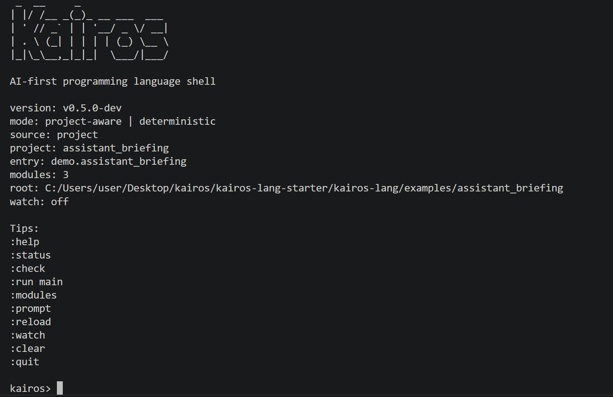

# Kairos

Kairos is a Rust-based programming language and tooling workspace for `.kai` files.

Tagline: *Code the right answer at the right moment.*

Kairos is intentionally AI-first. The language is designed so source code stays readable to humans, explicit for downstream LLM systems, and stable when exported as machine-readable structures.

## Current status

Kairos v0.5 is a working terminal-native language toolchain for small deterministic projects:

- lexer, parser, AST, semantic analysis, KIR, formatter, interpreter, and CLI
- project-aware workflows through `kairos.toml`
- multi-file loading and deterministic module resolution with `use`
- stable AST / IR / prompt / diagnostic JSON pathways
- Kairos-branded interactive shell with reload and watch workflows
- project scaffolding through `kairos new` and `kairos init`
- bundled examples for AI context, rules, and stdlib usage

## Demo

<p align="center">
  
</p>

Kairos v0.5 introduces a terminal-native shell with project-aware workflows,
reload, watch mode, and project scaffolding.

## Quick start

```powershell
cargo build --workspace
cargo test --workspace

cargo run --bin kairos -- check examples\assistant_briefing
cargo run --bin kairos -- prompt examples\assistant_briefing
cargo run --bin kairos -- run examples\decision_bundle --function classify --arg 72 --json

cargo run --bin kairos -- shell examples\assistant_briefing
cargo run --bin kairos -- new demo_project
```

## Terminal workflow

Kairos v0.5 adds a line-oriented interactive shell:

```powershell
cargo run --bin kairos -- shell examples\assistant_briefing
```

The shell shows a Kairos startup banner, version, mode, project/package metadata, and quick-start commands before presenting the `kairos>` prompt.

Typical shell commands:

- `:help`
- `:status`
- `:modules`
- `:check`
- `:prompt`
- `:run main`
- `:reload`
- `:watch`
- `:unwatch`
- `:quit`

Shell behavior is still deterministic and project-aware. `:reload` re-reads the current target from disk, and `:watch` keeps validating the current file or project in-session while you edit from VS Code or another terminal.

## Project scaffolding

Kairos can bootstrap new projects:

```powershell
cargo run --bin kairos -- new demo_project
cargo run --bin kairos -- new briefing_demo --template briefing

Set-Location .\demo_project
cargo run --bin kairos -- check .
cargo run --bin kairos -- shell .
```

Or initialize the current directory:

```powershell
cargo run --bin kairos -- init
cargo run --bin kairos -- init --template rules
```

Current templates:

- `default`
- `briefing`
- `rules`

Generated projects are validated immediately after scaffolding.

## Supported CLI

Kairos supports these primary flows:

- `kairos check <file-or-project> [--json]`
- `kairos fmt <file-or-project> [--check] [--stdout]`
- `kairos ast <file-or-project> --json`
- `kairos ir <file-or-project> --json`
- `kairos prompt <file-or-project>`
- `kairos run <file-or-project> [--function <name>] [--arg <value> ...] [--json]`
- `kairos shell [path]`
- `kairos new <name> [--template <template>]`
- `kairos init [--template <template>]`

Existing v0.2 JSON outputs remain stable. The new shell is human-oriented and does not replace the machine-readable subcommands.

## Project model

Kairos projects are rooted by `kairos.toml`.

```toml
[package]
name = "assistant_briefing"
version = "0.5.0-dev"
entry = "src/main.kai"

[build]
emit = ["ast", "ir", "prompt"]
```

Current rules:

- the entry file must point to a `.kai` source file
- the parent directory of the entry file is treated as the project source root
- every `.kai` file under that source root is loaded deterministically
- modules are resolved by `module` declaration and imported with `use demo.shared.text;`
- duplicate module names, unresolved imports, and import cycles are hard errors

## Supported language/tooling subset

Kairos currently supports:

- `module` and `use`
- `context { ... }`
- `schema`, `enum`, and `type`
- `fn` declarations with `describe`, `tags`, `requires`, and `ensures`
- literals, identifiers, calls, lists, objects, and binary expressions
- `let`, `return`, `if`, and `else if`
- deterministic project-aware imports across multiple `.kai` files

Deterministic stdlib helpers include:

- string helpers: `len`, `concat`, `contains`, `starts_with`, `ends_with`, `trim`, `upper`, `lower`
- list helpers: `join`, `first`, `last`, `all`, `any`
- object helpers: `has_key`, `get_str`, `get_int`, `keys`
- numeric helpers: `abs`, `min`, `max`, `clamp`

## Example projects

- `examples/hello_context`: smallest single-module smoke test
- `examples/video_context`: type declarations and prompt export
- `examples/risk_rules`: deterministic single-file rule execution
- `examples/assistant_briefing`: multi-file AI-context project
- `examples/decision_bundle`: multi-file rules/decision engine project
- `examples/stdlib_playbook`: multi-file stdlib demonstration

## Build and validation

```powershell
cargo build --workspace
cargo test --workspace
cargo fmt --all
cargo fmt --all -- --check
cargo clippy --workspace --all-targets --all-features -- -D warnings
```

These commands pass in the current repository state.

## Limitations

Kairos is still intentionally narrow in this phase:

- one local project root at a time
- no package registry or remote dependency model
- no selective imports, aliasing, or visibility keywords yet
- the shell is line-oriented, not a full-screen TUI
- watch mode is session-only and does not auto-run entry functions by default
- no networking, file I/O for user programs, randomness, time, async runtime, or macro system
- semantic diagnostics are structured and readable, but not every semantic error has a fully rich span yet

## Documentation

- [ARCHITECTURE.md](ARCHITECTURE.md)
- [ROADMAP.md](ROADMAP.md)
- [docs/cli.md](docs/cli.md)
- [docs/language-overview.md](docs/language-overview.md)
- [docs/projects.md](docs/projects.md)
- [docs/shell.md](docs/shell.md)
- [docs/syntax.md](docs/syntax.md)

## License

Kairos is licensed under MIT. See [LICENSE](LICENSE).
