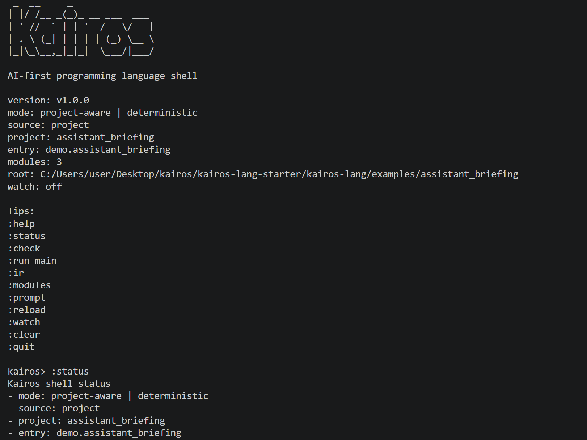

# Kairos

Kairos is an AI-first programming language and terminal-native toolchain for deterministic `.kai` projects.

Tagline: *Code the right answer at the right moment.*

Kairos is designed for code that needs to be readable by humans, reliable for automation, and directly useful to downstream LLM systems. The language favors explicit meaning, explicit contracts, stable machine-readable outputs, and predictable project workflows over clever implicit behavior.

## Kairos 1.0

Kairos v1.0 is a release-ready local toolchain for small deterministic language projects:

- lexer, parser, AST, semantic analysis, KIR, formatter, interpreter, and CLI
- project-aware workflows through `kairos.toml`
- multi-file loading with deterministic module resolution through `use`
- stable AST JSON, KIR JSON, prompt markdown, and structured diagnostics
- interactive shell with reload and watch workflows
- project scaffolding through `kairos new` and `kairos init`
- bundled examples for AI context, decision logic, and stdlib usage

## Why Kairos exists

Kairos treats source code as something that should be understandable by:

- humans
- compilers
- LLMs
- retrieval systems
- prompt and policy pipelines

Instead of hiding intent in comments or repository folklore, Kairos makes meaning explicit through:

- `context` blocks
- function-level `describe`
- `tags`
- `requires`
- `ensures`
- deterministic project/module boundaries

## Install

### Local development

```powershell
cargo build --workspace
cargo test --workspace
```

### Local install

```powershell
cargo install --path crates/kairos-cli
```

After that, you can run `kairos` directly from PowerShell, Windows Terminal, or the VS Code terminal.

## Quick start

The fastest way to explore Kairos is to use a bundled example:

```powershell
cargo run --bin kairos -- check examples\assistant_briefing
cargo run --bin kairos -- prompt examples\assistant_briefing
cargo run --bin kairos -- shell examples\assistant_briefing
```

If you want the smallest first example:

```powershell
cargo run --bin kairos -- check examples\hello_context
cargo run --bin kairos -- run examples\hello_context --json
```

## Shell

Kairos includes a line-oriented interactive shell:

```powershell
cargo run --bin kairos -- shell examples\assistant_briefing
```

The shell shows a Kairos startup banner, version, current mode, project metadata, and quick-start commands before presenting the prompt.

<p align="center">
  
</p>

Useful shell commands:

- `:help`
- `:status`
- `:modules`
- `:check`
- `:prompt`
- `:run main`
- `:reload`
- `:watch`
- `:unwatch`
- `:quit`

The shell is human-oriented, but it still calls the real project loader, parser, semantic analyzer, KIR lowering, and interpreter. It is not a toy mode layered on top of fake summaries.

## Create a project

```powershell
cargo run --bin kairos -- new demo_project
cargo run --bin kairos -- new briefing_demo --template briefing

Set-Location .\demo_project
cargo run --bin kairos -- check .
cargo run --bin kairos -- shell .
```

Or initialize the current directory:

```powershell
cargo run --bin kairos -- init
cargo run --bin kairos -- init --template rules
```

Available templates:

- `default`
- `briefing`
- `rules`

Generated projects validate immediately and avoid overwriting existing files.

## Core CLI

Kairos 1.0 keeps the command surface focused:

- `kairos check <file-or-project> [--json]`
- `kairos fmt <file-or-project> [--check] [--stdout]`
- `kairos ast <file-or-project> [--json]`
- `kairos ir <file-or-project> [--json]`
- `kairos prompt <file-or-project>`
- `kairos run <file-or-project> [--function <name>] [--arg <value> ...] [--json]`
- `kairos shell [path]`
- `kairos new <name> [--template <template>]`
- `kairos init [--template <template>]`

Machine-readable commands remain quiet and stable in JSON mode. Human-readable flows such as `shell`, `check`, and default `run` output are intentionally optimized for terminal use.

## Project model

Kairos projects are rooted by `kairos.toml`:

```toml
[package]
name = "assistant_briefing"
version = "1.0.0"
entry = "src/main.kai"

[build]
emit = ["ast", "ir", "prompt"]
```

Current rules:

- `package.entry` must point to a relative `.kai` file inside the project
- the parent directory of `package.entry` is treated as the project source root
- every `.kai` file under that source root is loaded deterministically
- modules are resolved by explicit `module` declarations and imported with `use`
- unresolved imports, duplicate module names, and import cycles are hard errors

## Deterministic outputs

Kairos emits stable artifacts for downstream tooling:

- AST JSON for syntax structure
- KIR JSON for normalized machine-facing structure
- prompt markdown for system/context generation
- structured diagnostics with severity, code, message, location, and related notes
- deterministic interpreter execution reports

## Bundled examples

- `examples/hello_context`: smallest single-module smoke test
- `examples/video_context`: context + type declarations + prompt export
- `examples/risk_rules`: deterministic rule execution in one file
- `examples/assistant_briefing`: multi-file AI-context project
- `examples/decision_bundle`: multi-file decision/rules project
- `examples/stdlib_playbook`: multi-file stdlib showcase

## Validation

```powershell
cargo build --workspace
cargo test --workspace
cargo fmt --all
cargo fmt --all -- --check
cargo clippy --workspace --all-targets --all-features -- -D warnings
```

These commands pass in the current repository state.

## What Kairos intentionally does not do in 1.0

Kairos 1.0 stays focused:

- no package registry or remote dependency model
- no selective imports, aliasing, or visibility modifiers yet
- no user-program networking, file I/O, randomness, wall-clock time, or async runtime
- no full-screen TUI or editor/LSP layer yet
- no attempt to be an unrestricted general-purpose OS scripting language

This narrow scope is deliberate. Kairos is strongest when it stays deterministic, explicit, and reviewable.

## Documentation

- [ARCHITECTURE.md](ARCHITECTURE.md)
- [ROADMAP.md](ROADMAP.md)
- [CONTRIBUTING.md](CONTRIBUTING.md)
- [docs/cli.md](docs/cli.md)
- [docs/language-overview.md](docs/language-overview.md)
- [docs/projects.md](docs/projects.md)
- [docs/shell.md](docs/shell.md)
- [docs/syntax.md](docs/syntax.md)
- [specs/kairos.ebnf](specs/kairos.ebnf)
- [specs/kairos-ir.schema.json](specs/kairos-ir.schema.json)

## License

Kairos is licensed under MIT. See [LICENSE](LICENSE).
